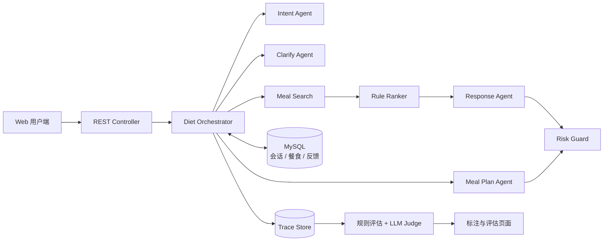

# Diet Planning Agent

一套面向“今天吃什么”场景的多 Agent 对话式餐食推荐与规划系统。系统结合用户当前心情、用餐场景、健康目标和口味偏好，从公共餐食库或个人菜单中检索候选，并生成可解释的推荐结果。

项目同时提供 Trace 链路回放、人工标注和批量离线评估能力，用于定位 LLM 调用问题并持续验证推荐质量。

## 核心能力

- **多 Agent 编排：** 将意图识别、槽位澄清、单餐推荐、多餐规划、回复生成和质量评估拆分为独立推理单元，由 Orchestrator 统一维护会话状态与路由。
- **双数据源推荐：** 支持公共餐食库与用户个人菜单，根据餐次、心情、场景、健康目标、菜系、口味和便利性完成检索与重排。
- **多轮对话状态：** 保存历史槽位、当前阶段及已推荐餐食，支持补充条件、换一批和连续多餐规划。
- **安全与降级：** 对低置信意图、槽位不足、模型异常和健康风险提供规则纠偏、模板回复及保守回答。
- **Trace 可观测性：** 记录请求、意图、槽位、检索、排序、模型回复、风险检查和最终响应等关键事件。
- **离线评估：** 综合规则指标、LLM Judge 与用户反馈生成百分制报告，并支持人工标注意图、槽位和澄清动作。

## 系统架构



一次推荐请求的主要流程：

1. 加载或创建会话，记录本轮 Trace。
2. Intent Agent 识别意图并抽取七类槽位。
3. 规则层结合历史状态修正意图并合并槽位。
4. 信息不足时进入 Clarify Agent；信息充分时检索并重排餐食。
5. Response Agent 生成推荐理由与展示内容。
6. Risk Guard 检查医疗承诺、极端节食等风险表达。
7. 保存会话状态、助手回复和完整调用链。

## 技术栈

| 分类 | 技术 |
| --- | --- |
| 后端 | Java 21、Spring Boot 3.3、MyBatis |
| Agent | AgentScope Java、DashScope / Qwen |
| 数据库 | MySQL 8 |
| 前端 | HTML、CSS、Vanilla JavaScript |
| 构建 | Maven |

## 项目结构

```text
src/main/java/com/diet
├── builder/          # Agent 构建器
├── controller/       # 对话、餐食、Trace、反馈与评估接口
├── service/
│   ├── orchestrator/ # 对话状态机与流程编排
│   ├── intent/       # 意图识别与规则纠偏
│   ├── clarify/      # 槽位完整性判断与追问
│   ├── meal/         # 候选检索与规则重排
│   ├── recommend/    # 单餐推荐回复生成
│   ├── plan/         # 多餐规划
│   ├── risk/         # 健康风险守卫
│   ├── trace/        # Trace 采集与查询
│   └── evaluation/   # 离线评估
└── model/            # 请求、响应与领域模型

src/main/resources
├── db/diet_db.sql    # 数据库表结构与演示数据
├── diet/prompts/     # Agent Prompt
├── mapper/           # MyBatis XML
└── static/           # 用户端与研发端页面
```

## 本地运行

### 1. 获取代码

```powershell
git clone https://github.com/ciwen363/diet-planning-agent.git
cd diet-planning-agent
```

### 2. 环境要求

- JDK 21
- Maven 3.9+
- MySQL 8.x
- 可用的 DashScope API Key

### 3. 初始化数据库

创建数据库后，将 `src/main/resources/db/diet_db.sql` 导入 `diet_db`：

```sql
CREATE DATABASE IF NOT EXISTS diet_db
  DEFAULT CHARACTER SET utf8mb4
  COLLATE utf8mb4_unicode_ci;
USE diet_db;
SOURCE C:/your-path/diet-planning-agent/src/main/resources/db/diet_db.sql;
```

也可以使用 MySQL Workbench、Navicat 等客户端选择 `diet_db` 后执行该 SQL 文件。

### 4. 配置环境变量

PowerShell 示例：

```powershell
$env:DB_USERNAME = "root"
$env:DB_PASSWORD = "your-database-password"
$env:DASHSCOPE_API_KEY = "your-dashscope-api-key"
```

可选配置：

| 环境变量 | 默认值 | 说明 |
| --- | --- | --- |
| `DB_URL` | `jdbc:mysql://localhost:3306/diet_db?...` | MySQL JDBC 地址 |
| `DB_USERNAME` | `root` | 数据库用户名 |
| `DB_PASSWORD` | 空 | 数据库密码 |
| `DASHSCOPE_API_KEY` | 空 | DashScope 调用凭据 |
| `DIET_MAIN_MODEL` | `qwen-max` | 推荐与规划回复模型 |
| `DIET_LIGHT_MODEL` | `qwen-turbo` | 意图识别与澄清模型 |
| `SERVER_PORT` | `8080` | 服务端口 |

> 不要将真实密码或 API Key 写入 `application.yml`、README 或 Git 提交。

### 5. 启动项目

```powershell
mvn spring-boot:run
```

启动后访问：<http://localhost:8080>

也可以先构建再运行：

```powershell
mvn clean package
java -jar target/diet-planning-agent-1.0-SNAPSHOT.jar
```

## 主要接口

| 方法 | 路径 | 说明 |
| --- | --- | --- |
| `POST` | `/api/v1/diet/sessions` | 创建会话 |
| `POST` | `/api/v1/diet/chat` | 发送消息并获取推荐或澄清问题 |
| `GET` | `/api/v1/diet/meals/personal` | 查询个人餐食 |
| `POST` | `/api/v1/diet/meals/personal` | 新增个人餐食 |
| `PUT` | `/api/v1/diet/meals/personal/{mealId}` | 修改个人餐食 |
| `DELETE` | `/api/v1/diet/meals/personal/{mealId}` | 删除个人餐食 |
| `GET` | `/api/v1/diet/meals/public` | 查询公共餐食 |
| `POST` | `/api/v1/diet/feedback` | 提交推荐反馈 |
| `GET` | `/api/v1/diet/debug/traces/{traceId}` | 查询单条 Trace |
| `PUT` | `/api/v1/diet/debug/traces/{traceId}/label` | 标注意图、槽位和澄清动作 |
| `POST` | `/api/v1/diet/evaluations` | 批量生成离线评估报告 |

接口默认通过请求头 `X-User-Id` 区分用户，本地调试时缺省值为 `1`。

### 对话请求示例

```powershell
curl.exe -X POST "http://localhost:8080/api/v1/diet/chat" `
  -H "Content-Type: application/json" `
  -H "X-User-Id: 1" `
  -d '{"sessionId":null,"message":"今天有点累，晚饭想吃清淡一点","sourceMode":"PUBLIC","context":{}}'
```

`sourceMode` 支持：

- `PUBLIC`：从公共餐食库推荐。
- `PERSONAL`：只从当前用户维护的个人菜单中推荐。

## 评估指标

离线评估会从 Trace 中提取并汇总以下信息：

- 意图识别准确性
- 槽位抽取准确性
- 澄清动作准确性
- Token 消耗与端到端耗时
- Fallback 触发情况
- 推荐安全性与候选一致性
- 多轮调整一致性
- LLM Judge 的解释质量与自然度评分
- 用户评分及反馈行为

## 当前边界

- 项目定位为本地演示与工程方案验证，接口暂未接入生产级身份认证与权限体系。
- 模型与数据库均为外部依赖，完整链路测试前需要正确配置 MySQL 和 DashScope。
- Trace 可能包含用户输入与模型输出，部署到共享环境前应增加脱敏、访问控制和数据保留策略。
